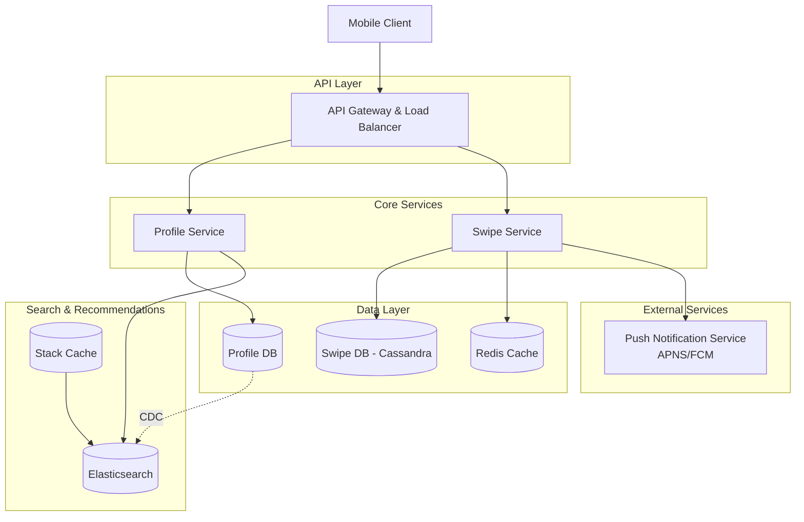
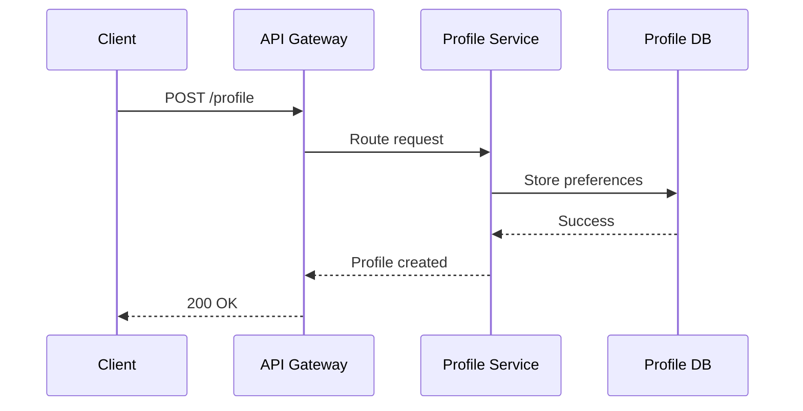
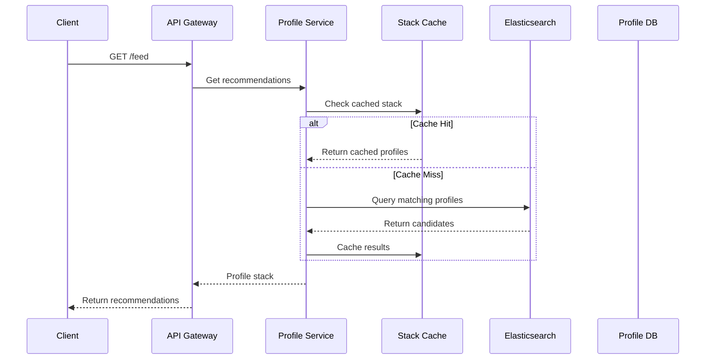
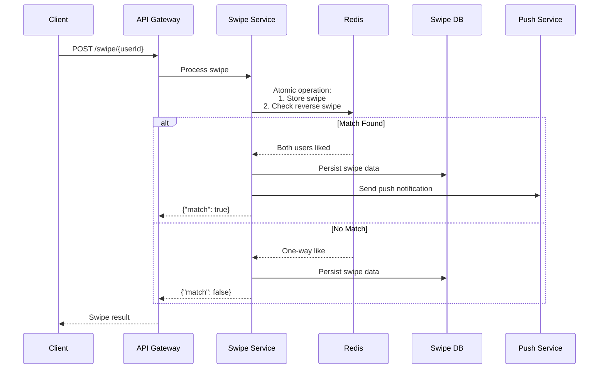
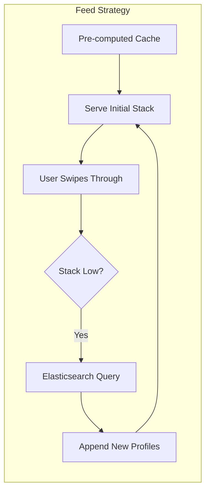
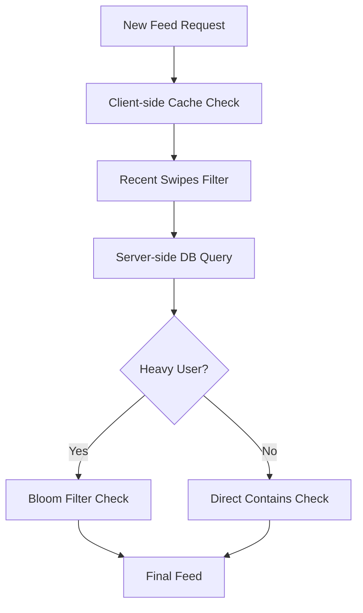

# Tinder System Design Interview Guide

## 🎯 Problem Overview

Design a dating app like Tinder that allows users to:

- Create profiles with preferences
- View and swipe on potential matches
- Get notified when mutual matches occur
- Chat after matching (out of scope for core design)

## 📋 Requirements Gathering

### Functional Requirements

1. **Profile Creation**: Users can create profiles with preferences (age range, interests, max distance)
2. **Match Discovery**: Users can view a stack of potential matches based on filters and location
3. **Swiping**: Users can swipe right (like) or left (pass) on profiles
4. **Match Notifications**: Users get notified when they mutually like each other

### Non-Functional Requirements

1. **Consistency**: Strong consistency for swiping to ensure matches are detected
2. **Scale**: Support 20M daily active users, ~100 swipes/user/day
3. **Low Latency**: Feed loading < 300ms
4. **No Duplicates**: Avoid showing previously swiped profiles

### Out of Scope

- Image uploads and storage
- Chat functionality after matching
- Premium features (super swipes, etc.)
- Fraud detection

## 🏗️ Core Entities

```
User:
- user_id (UUID)
- name, bio, age
- age_preference_min/max
- gender_preference
- max_distance
- location (lat, long)

Swipe:
- user_pair (partition key)
- from_user (clustering key)
- to_user (clustering key)
- direction (yes/no)
- created_at

Match:
- match_id
- user1_id
- user2_id
- created_at
```

## 🔌 API Design

### Core Endpoints

```http
# Create/Update Profile
POST /profile
{
  "age_min": 20,
  "age_max": 30,
  "distance": 10,
  "interested_in": "female|male|both"
}

# Get Feed of Potential Matches
GET /feed?lat={lat}&long={long}
Response: User[]

# Record Swipe Decision
POST /swipe/{userId}
{
  "decision": "yes|no"
}
Response: { "match": true/false }
```

## 🏛️ High-Level Architecture



## 🔄 Core Workflows

### 1. Profile Creation Flow



### 2. Feed Generation Flow



### 3. Swipe and Match Flow



## 🚀 Deep Dive Solutions

### 1. Ensuring Swipe Consistency

**Problem**: Race condition when two users swipe on each other simultaneously

**Solution**: Redis with Atomic Operations

```python
# Use sorted user IDs for consistent partitioning
def get_swipe_key(user_a, user_b):
    sorted_ids = sorted([user_a, user_b])
    return f"swipes:{sorted_ids[0]}:{sorted_ids[1]}"

# Atomic Lua script for swipe + match check
lua_script = """
redis.call('HSET', KEYS[1], ARGV[1], ARGV[2])
return redis.call('HGET', KEYS[1], ARGV[3])
"""

def handle_swipe(from_user, to_user, direction):
    key = get_swipe_key(from_user, to_user)
    other_swipe = redis.eval(
        lua_script,
        keys=[key],
        args=[f"{from_user}_swipe", direction, f"{to_user}_swipe"]
    )

    if direction == 'right' and other_swipe == 'right':
        return create_match(from_user, to_user)
```

### 2. Low-Latency Feed Generation

**Hybrid Approach**: Pre-computation + Real-time Search



**Implementation**:

- **Cron jobs** pre-compute stacks for active users
- **Elasticsearch** handles real-time queries with geo-spatial indexing
- **Cache invalidation** with TTL (< 1 hour) to avoid stale profiles

### 3. Avoiding Duplicate Profiles

**Multi-layered Approach**:



**Client-side Cache**: Store last K swipes to filter new recommendations
**Bloom Filter**: For users with extensive swipe history (prevents false negatives)
**Database Query**: Partition by swiping_user_id for efficient lookups

## 📊 Scale Considerations

### Data Volume Estimates

- **20M DAU × 100 swipes/day = 2B swipes/day**
- **Storage**: ~200GB/day for swipe data
- **Read Load**: Profile queries, match checks
- **Write Load**: Massive swipe writes

### Database Choices

| Component        | Database      | Rationale                               |
| ---------------- | ------------- | --------------------------------------- |
| **Profiles**     | PostgreSQL    | ACID compliance, complex queries        |
| **Swipes**       | Cassandra     | Write-optimized, partition by user_pair |
| **Search Index** | Elasticsearch | Geo-spatial queries, full-text search   |
| **Caching**      | Redis         | Atomic operations, low latency          |

### Partitioning Strategy

- **Swipe Data**: Partition by `user_pair` (sorted user IDs)
- **Profile Data**: Partition by `user_id`
- **Geographic Sharding**: Consider location-based partitioning

## 🔧 Technology Stack

### Core Infrastructure

- **Load Balancer**: NGINX/HAProxy
- **API Gateway**: Kong/AWS API Gateway
- **Message Queue**: Kafka (for async processing)
- **CDN**: CloudFront (for profile images)

### Monitoring & Observability

- **Metrics**: Prometheus + Grafana
- **Logging**: ELK Stack
- **Tracing**: Jaeger
- **Alerts**: PagerDuty

## 🎯 Interview Tips by Level

### Mid-Level (E4)

- Focus on **functional requirements** (80% breadth, 20% depth)
- Design basic architecture meeting all requirements
- Expect interviewer to probe component knowledge
- Should handle: API design, basic scaling, simple caching

### Senior (E5)

- Demonstrate **deep technical knowledge** (60% breadth, 40% depth)
- Proactively identify bottlenecks and trade-offs
- Should handle: Advanced indexing, consistency patterns, performance optimization
- Expected deep dives: Feed generation algorithms, match detection consistency

### Staff+ (E6+)

- **Lead the conversation** (40% breadth, 60% depth)
- Show production experience and battle-tested solutions
- Should handle: Complex distributed systems, fault tolerance, operational concerns
- Expected: Innovative solutions, technology choice justification, disaster recovery

## 🧪 Testing & Validation

### Load Testing Scenarios

1. **Concurrent Swipes**: Same user pair swiping simultaneously
2. **Hot Partitions**: Popular users causing data skew
3. **Feed Exhaustion**: Heavy users running out of cached profiles
4. **Geographic Clustering**: High user density in metro areas

### Failure Scenarios

1. **Redis Cluster Failure**: Graceful degradation to Cassandra
2. **Elasticsearch Downtime**: Fallback to cached feeds only
3. **Database Partitioning**: Handle partition splits/merges
4. **Network Partitions**: Handle eventual consistency edge cases

## 📚 Additional Considerations

### Security

- **Rate Limiting**: Prevent spam swiping
- **Authentication**: JWT tokens with refresh mechanism
- **Data Privacy**: GDPR compliance, data encryption
- **Bot Detection**: Machine learning for fake profile detection

### Business Metrics

- **Match Rate**: Percentage of mutual likes
- **User Engagement**: Daily swipes per user
- **Geographic Distribution**: User density mapping
- **Churn Analysis**: User retention patterns

### Future Enhancements

- **ML Recommendations**: Improve match quality with ML models
- **Video Profiles**: Support for video content
- **Social Features**: Mutual friends, shared interests
- **Premium Features**: Super likes, location spoofing

---

## 🎪 Mock Interview Flow

1. **Requirements (5-7 min)**: Clarify functional/non-functional requirements
2. **High-level Design (10-15 min)**: Core architecture and API design
3. **Deep Dives (20-25 min)**: Focus on 2-3 complex areas
4. **Scale & Operations (5-10 min)**: Monitoring, deployment, failure handling
5. **Follow-up Questions (5 min)**: Extensions, trade-offs, lessons learned

**Key Success Factors**:

- Start simple, then add complexity
- Justify every technology choice
- Discuss trade-offs explicitly
- Show production experience where relevant
- Ask clarifying questions throughout

# Tinder System Design - Last Minute Revision

## 🎯 Core Problem Statement

Design a dating app supporting 20M DAU with profile matching, swiping, and match notifications.

## 📋 Requirements Checklist

**Functional Requirements:**

- Profile creation with preferences (age, distance, interests)
- Match discovery based on location and filters
- Swipe left/right functionality
- Mutual match detection and notifications

**Non-Functional Requirements:**

- Scale: 20M DAU × 100 swipes/day = 2B swipes/day
- Latency: Feed loading < 300ms
- Consistency: Strong consistency for match detection
- No duplicate profiles in feed

## 🏗️ Architecture Components

**Core Services:**

- Profile Service (user data, preferences)
- Swipe Service (handles swipes, detects matches)
- API Gateway + Load Balancer

**Data Storage:**

- PostgreSQL for profiles (ACID compliance)
- Cassandra for swipes (write-optimized, partition by user_pair)
- Redis for match detection (atomic operations)
- Elasticsearch for profile search (geo-spatial queries)

## 🔑 Critical Design Decisions

### Match Detection (Prevent Race Conditions)

- Use Redis with Lua scripts for atomic swipe + match check
- Partition key: sorted user IDs for consistency
- Store both directions in same Redis hash

### Feed Generation Strategy

- **Hybrid approach:** Pre-computed cache + real-time search
- Elasticsearch with geo-spatial indexing
- Cache invalidation with TTL < 1 hour
- Bloom filters for heavy users to avoid duplicates

### Database Partitioning

- Swipe data: Partition by `user_pair` (sorted user IDs)
- Profile data: Partition by `user_id`
- Consider geographic sharding for high-density areas

## 🚀 Scalability Solutions

### Handle 2B Daily Swipes

- Cassandra write-optimized storage
- Horizontal scaling with consistent hashing
- Async processing with Kafka for non-critical operations

### Low-Latency Feed (< 300ms)

- Pre-compute stacks for active users via cron jobs
- Multi-level caching (Redis, CDN)
- Elasticsearch with proper indexing

### Avoid Duplicates

- Client-side cache for recent swipes
- Server-side Bloom filters for heavy users
- Database contains checks with partitioned queries

## 🔧 Technology Stack Summary

- **Load Balancer:** NGINX/HAProxy
- **Caching:** Redis (atomic ops), CDN (static content)
- **Search:** Elasticsearch (geo-spatial)
- **Queue:** Kafka (async processing)
- **Push Notifications:** APNS/FCM
- **Monitoring:** Prometheus + Grafana

## 🎯 Interview Strategy by Level

### Mid-Level (E4)

- Focus on meeting all functional requirements
- Basic architecture with simple scaling
- Expect probing on component choices
- Show understanding of caching and database basics

### Senior (E5)

- Proactively identify bottlenecks and trade-offs
- Deep dive into 2-3 complex areas
- Demonstrate production experience
- Advanced topics: consistency patterns, performance optimization

### Staff+ (E6+)

- Lead the conversation, show innovative solutions
- Focus heavily on operational concerns
- Justify every technology choice
- Discuss disaster recovery and fault tolerance

## 🧪 Key Failure Scenarios

- **Redis cluster failure:** Graceful degradation to Cassandra
- **Elasticsearch downtime:** Fallback to cached feeds only
- **Race conditions:** Atomic operations prevent duplicate matches
- **Hot partitions:** Load balancing and data distribution strategies

## 💡 Pro Tips for Success

- **Start simple, add complexity gradually**
- **Justify every technology choice with trade-offs**
- **Ask clarifying questions throughout**
- **Draw diagrams for complex workflows**
- **Discuss monitoring and operational concerns**
- **Show production experience where relevant**

## 🎪 Mock Interview Timeline (45 mins)

1. **Requirements (5-7 min):** Clarify scope and constraints
2. **High-level Design (10-15 min):** Architecture and APIs
3. **Deep Dives (20-25 min):** 2-3 complex problem areas
4. **Scale & Operations (5-10 min):** Monitoring, deployment
5. **Follow-up (5 min):** Extensions and trade-offs

## 🔢 Key Numbers to Remember

- **20M DAU, 100 swipes/user/day**
- **2B swipes/day total**
- **~200GB/day storage growth**
- **< 300ms feed loading requirement**
- **Strong consistency for match detection**

## 🎯 Common Deep Dive Topics

1. **Match detection race conditions and solutions**
2. **Feed generation algorithms and caching strategies**
3. **Database partitioning and sharding strategies**
4. **Handling geographic distribution and hot spots**
5. **Preventing duplicate profiles in recommendations**
