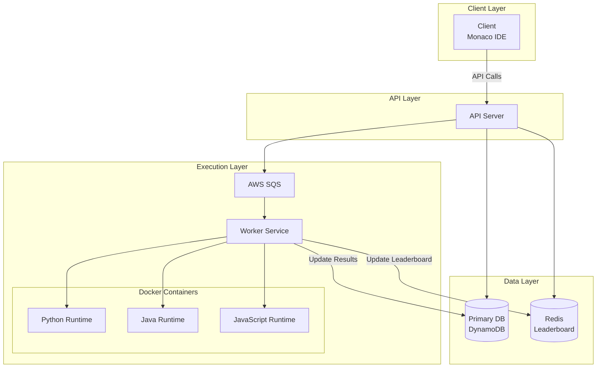
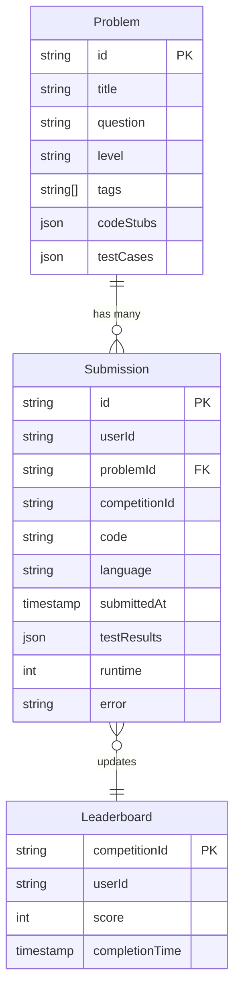
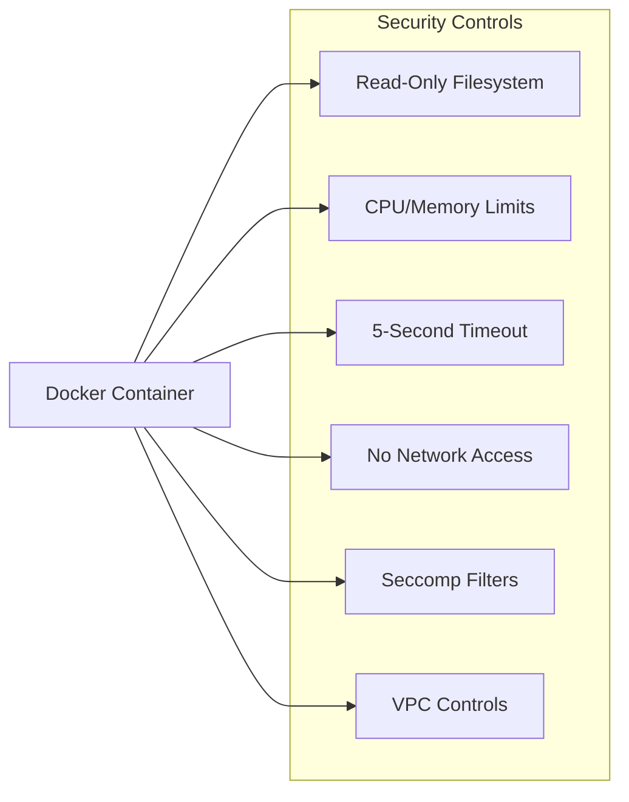
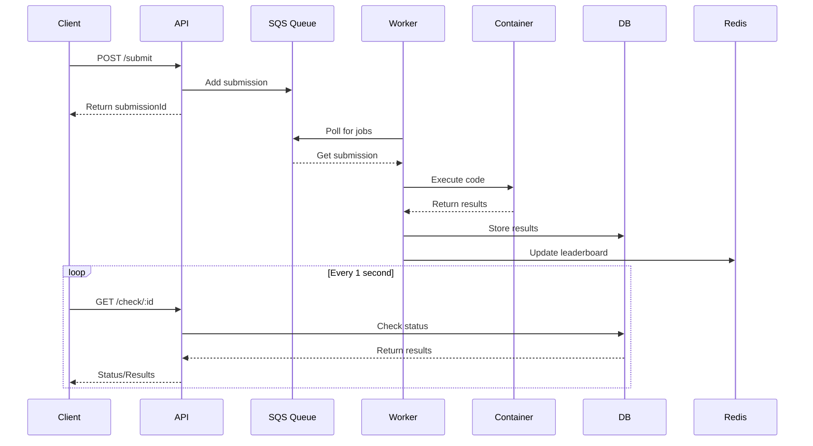
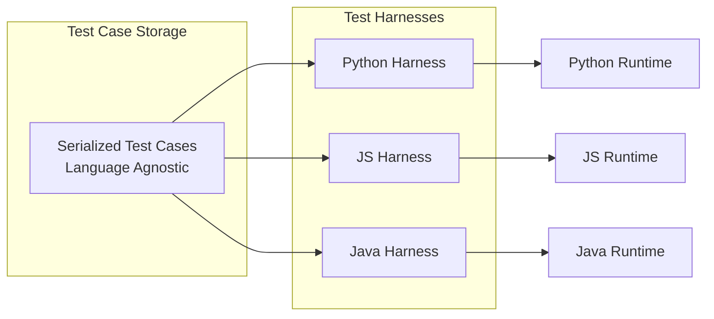
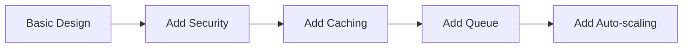
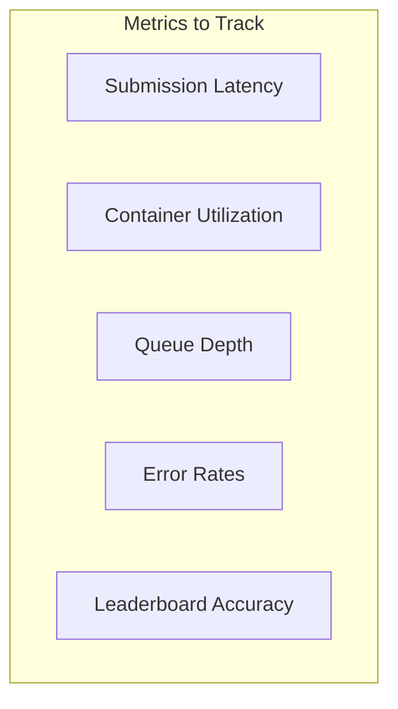

# LeetCode (Online Judge) System Design Interview Guide

## 📌 Quick Overview

**LeetCode** is a platform for coding interview preparation with:

- Coding problems (easy to hard)
- Multi-language support
- Real-time code execution and feedback
- Competitive programming contests
- ~100K users, ~4000 problems (relatively small scale)

## 🎯 Requirements

### Functional Requirements (Core)

1. **View list of coding problems** (with pagination)
2. **View specific problem** and code solutions in multiple languages
3. **Submit solution** and get instant feedback (<5 seconds)
4. **View live leaderboard** for competitions

### Non-Functional Requirements

1. **Availability > Consistency**
2. **Security & Isolation** when running user code
3. **Low latency** - Return results within 5 seconds
4. **Scale** to support 100K concurrent users in competitions

### Out of Scope

- User authentication/profiles
- Payment processing
- Social features
- Analytics

## 🏗️ System Architecture

### High-Level Design



## 📊 Data Models

### Core Entities



### Problem Schema

```javascript
{
  id: string,
  title: string,
  question: string,
  level: "easy" | "medium" | "hard",
  tags: string[],
  codeStubs: {
    python: string,
    javascript: string,
    java: string,
    // ... other languages
  },
  testCases: [{
    type: string,     // "tree", "array", etc.
    input: string,    // Serialized input
    output: string    // Expected output
  }]
}
```

## 🔌 API Design

### Core Endpoints

| Method | Endpoint                      | Description             | Response                 |
| ------ | ----------------------------- | ----------------------- | ------------------------ |
| GET    | `/problems`                   | List problems           | `Partial<Problem>[]`     |
| GET    | `/problems/:id`               | Get problem details     | `Problem`                |
| POST   | `/problems/:id/submit`        | Submit solution         | `{submissionId: string}` |
| GET    | `/check/:id`                  | Check submission status | `Submission`             |
| GET    | `/leaderboard/:competitionId` | Get leaderboard         | `Leaderboard[]`          |

### API Request/Response Examples

```javascript
// Submit solution
POST /problems/:id/submit
{
  code: string,
  language: "python" | "javascript" | "java"
}
// Note: userId from JWT/session, NOT from request body

// Check submission (polling)
GET /check/:submissionId
// Returns: { status: "processing" | "completed", results: {...} }
```

## 🔐 Code Execution Security

### ❌ Bad Approach: Run in API Server

- **Security Risk**: Malicious code can compromise server
- **Performance**: CPU intensive, can crash server
- **Isolation**: No isolation, affects all requests

### ✅ Good Approaches

#### 1. Virtual Machines (VMs)

- **Pros**: Strong isolation, full OS stack
- **Cons**: Resource intensive, slow startup, costly

#### 2. **Docker Containers** (Recommended)

- **Pros**: Lightweight, fast startup, good isolation
- **Cons**: Shares host kernel (needs proper config)

#### 3. Serverless Functions

- **Pros**: Auto-scaling, managed infrastructure
- **Cons**: Cold start latency, resource limits

### Container Security Measures



**Implementation Details:**

- **Read-only filesystem** (writes to /tmp only)
- **Resource limits**: CPU and memory bounds
- **Timeout**: Kill process after 5 seconds
- **Network isolation**: VPC security groups
- **System calls**: Restricted via seccomp

## 📈 Scaling Strategies

### Problem: Handling 100K Concurrent Users

#### ❌ Vertical Scaling

- Limited by max instance size (128 cores on AWS X1)
- Expensive, underutilized during off-peak
- **Math**: 10K submissions × 100 test cases × 100ms = 27 hours on single core!

#### ✅ Horizontal Scaling with Queue



**Benefits:**

- Handles traffic spikes
- Enables retries on failure
- Prevents container overload
- Auto-scaling with AWS ECS/Fargate

## 🏆 Leaderboard Implementation

### Evolution of Solutions

#### 1. ❌ Direct DB Queries

```sql
SELECT userId, COUNT(*) as score
FROM submissions
WHERE competitionId = :id AND passed = true
GROUP BY userId
ORDER BY score DESC
```

**Problem**: High DB load with frequent polling

#### 2. ✅ Redis with Periodic Updates

- Cache leaderboard for 30 seconds
- Reduce DB queries
  **Problem**: Not real-time enough

#### 3. ✅✅ Redis Sorted Sets (Best)

```redis
# Update on submission
ZADD competition:leaderboard:{id} {score} {userId}

# Get top 100
ZREVRANGE competition:leaderboard:{id} 0 99 WITHSCORES
```

**Benefits**: O(log n) updates, O(m) retrieval, real-time

### Polling Strategy

- Default: Every 5 seconds
- Competition final minutes: Every 2 seconds
- Off-peak: Every 10 seconds

## 🧪 Test Case Execution

### Challenge: Language-Agnostic Test Cases



### Example: Binary Tree Problem

```javascript
// Serialized test case (language-agnostic)
{
  "type": "tree",
  "input": [3, 9, 20, null, null, 15, 7],  // Inorder traversal
  "output": 3  // Max depth
}

// Each language has TreeNode deserializer
// Python: class TreeNode with deserialize method
// Java: TreeNode class with deserialize method
// JS: TreeNode constructor with deserialize function
```

## 🎯 Interview Level Expectations

### Mid-Level (IC4)

- **Focus**: 80% breadth, 20% depth
- **Expected**:
  - Clear API design and data models
  - Basic understanding of containers/VMs
  - Functional high-level design
  - Security awareness (isolation needed)

### Senior (IC5)

- **Focus**: 60% breadth, 40% depth
- **Expected**:
  - Detailed security implementation
  - Trade-off analysis (VM vs Container vs Serverless)
  - Performance calculations
  - Proactive problem identification
  - Test harness implementation details

### Staff+ (IC6+)

- **Expected**:
  - Drive entire conversation
  - Simple, scalable design (avoid over-engineering)
  - Clear scaling path
  - Production considerations
  - Operational excellence

## 💡 Key Insights & Tips

### 1. **Start Simple**

- Monolithic architecture is fine for small scale
- Don't over-engineer initially

### 2. **Security First**

- Never run user code directly on servers
- Always mention isolation requirements early

### 3. **Real-World Patterns**

- LeetCode actually uses polling for submissions
- WebSockets often overkill for this scale

### 4. **Performance Math**

- Always do back-of-envelope calculations
- 10K submissions × 100 tests × 100ms = Important!

### 5. **Progressive Enhancement**



## 🚀 Advanced Considerations

### 1. **Multi-Region Deployment**

- CDN for problem statements
- Regional execution clusters
- Cross-region replication for competitions

### 2. **Optimization Techniques**

- Container pooling (warm containers)
- Test case result caching
- Incremental compilation

### 3. **Monitoring & Observability**



### 4. **Cost Optimization**

- Spot instances for containers
- Reserved capacity for predictable load
- Serverless for off-peak times

## 📝 Common Pitfalls to Avoid

1. **Don't pass userId in API requests** - Use JWT/session
2. **Don't mention localStorage** in artifacts - Not supported
3. **Don't over-complicate** for 100K users - It's relatively small
4. **Don't forget polling** for async operations
5. **Don't skip security discussion** - Critical for code execution

## 🔄 System Evolution Path

1. **MVP**: Simple monolith with Docker
2. **Scale**: Add queue and horizontal scaling
3. **Optimize**: Add caching and CDN
4. **Enterprise**: Multi-region, advanced monitoring

## 📚 Additional Resources

### Similar System Design Problems

- HackerRank
- CodeChef
- TopCoder Arena
- Google Code Jam infrastructure

### Related Patterns

- **Long-running tasks pattern**
- **Job queue pattern**
- **Real-time leaderboard pattern**
- **Sandboxed execution pattern**

---

## 🎓 Final Checklist for Interview

- [ ] Define clear requirements (functional & non-functional)
- [ ] Start with simple design, iterate
- [ ] Address security explicitly
- [ ] Do performance calculations
- [ ] Discuss trade-offs for each decision
- [ ] Consider scalability progressively
- [ ] Mention monitoring/operations
- [ ] Keep it practical, not theoretical

Remember: **The goal is to show systematic thinking, not to create the perfect system!**

# LeetCode System Design - Last Minute Revision

## 🎯 Core Requirements (30 seconds)

- **Functional**: View problems, submit code, get feedback <5s, live leaderboard
- **Non-functional**: 100K users, availability > consistency, secure code execution
- **Scale**: ~4000 problems, relatively small but need to handle competition spikes

## 🏗️ High-Level Architecture (1 minute)

- **Client**: Monaco IDE for coding
- **API Server**: Handle requests, coordinate services
- **Queue**: AWS SQS for async processing (critical for scale)
- **Workers**: Execute code in isolated containers
- **Storage**: DynamoDB (problems/submissions) + Redis (leaderboard)

## 🔐 Security - Most Critical Point (1 minute)

- **❌ NEVER**: Run user code directly on API servers
- **✅ GOOD**: Docker containers with strict limits
- **Controls**: Read-only filesystem, CPU/memory limits, 5s timeout, no network, seccomp filters

## 📊 Key Data Models (30 seconds)

- **Problem**: id, title, question, level, codeStubs{}, testCases[]
- **Submission**: id, userId, problemId, code, language, results, runtime
- **Leaderboard**: competitionId, userId, score, completionTime

## 🚀 Scaling Strategy (1 minute)

- **Problem**: 10K submissions × 100 tests × 100ms = 27 hours on single core!
- **Solution**: Horizontal scaling with job queue
- **Flow**: Submit → Queue → Worker → Container → Update DB/Redis
- **Auto-scaling**: AWS ECS/Fargate based on queue depth

## 🏆 Leaderboard Implementation (45 seconds)

- **❌ Bad**: Direct DB queries (high load)
- **✅ Good**: Redis Sorted Sets
- **Commands**: `ZADD` for updates, `ZREVRANGE` for top-N
- **Polling**: 5s normal, 2s during competition finals

## 📡 API Design (30 seconds)

- **GET** `/problems` - List with pagination
- **GET** `/problems/:id` - Problem details
- **POST** `/problems/:id/submit` - Submit code (returns submissionId)
- **GET** `/check/:id` - Poll for results (async pattern)
- **GET** `/leaderboard/:competitionId` - Rankings

## 🧪 Test Execution (30 seconds)

- **Challenge**: Language-agnostic test cases
- **Solution**: Serialized format + language-specific harnesses
- **Example**: Binary tree as `[3,9,20,null,null,15,7]` → each language deserializes

## ⚡ Performance Math (15 seconds)

- **Container startup**: ~100ms (Docker) vs ~30s (VM)
- **Queue processing**: Prevents overload, enables retries
- **Redis operations**: O(log n) updates, O(m) retrieval

## 🎯 Interview Level Expectations

### Mid-Level (IC4) - Focus on Breadth

- Clear API design and data models
- Basic container understanding
- Security awareness (mention isolation)
- Functional high-level architecture

### Senior (IC5) - Add Depth

- Detailed security implementation
- Trade-off analysis (VM vs Container vs Serverless)
- Performance calculations with numbers
- Test harness implementation details

### Staff+ (IC6+) - Drive Discussion

- Simple, scalable design (avoid over-engineering)
- Clear scaling evolution path
- Production considerations and monitoring
- Cost optimization strategies

## 🚨 Common Pitfalls to Avoid

- **Don't** pass userId in API requests (use JWT/session)
- **Don't** run code on API servers (security risk)
- **Don't** forget async polling for submission results
- **Don't** over-engineer for 100K users (relatively small scale)
- **Don't** skip security discussion (most critical aspect)

## 🔄 Progressive Design Approach

1. **Start**: Simple monolith with Docker containers
2. **Scale**: Add SQS queue and horizontal workers
3. **Optimize**: Add Redis caching and CDN
4. **Enterprise**: Multi-region deployment

## 💡 Key Talking Points

- **Security First**: Always mention code isolation early
- **Real-world Pattern**: Polling is common (LeetCode actually uses it)
- **Performance**: Do back-of-envelope calculations
- **Trade-offs**: VM (secure, slow) vs Container (fast, good isolation) vs Serverless (auto-scale, cold start)

## 🎬 30-Second Elevator Pitch

"LeetCode needs secure code execution for 100K users. I'd use Docker containers with strict security controls, process submissions through SQS queues with horizontal workers, store data in DynamoDB, and use Redis Sorted Sets for real-time leaderboards. The key is never running user code directly on servers and using async processing to handle scale."

## 📝 Must-Remember Security Controls

- Read-only filesystem (writes to /tmp only)
- CPU and memory limits
- 5-second execution timeout
- No network access via VPC security groups
- Restricted system calls via seccomp filters

## 🎯 Final Success Formula

**Requirements → Simple Design → Security → Scaling → Trade-offs → Monitoring**

_Remember: Show systematic thinking, not perfect system!_
