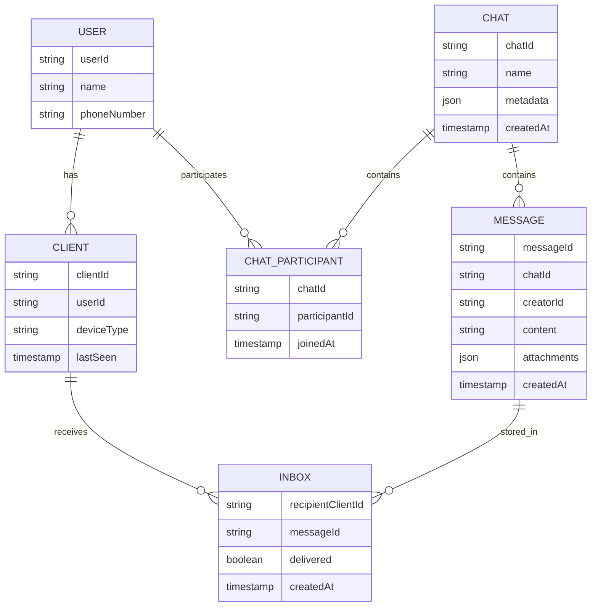
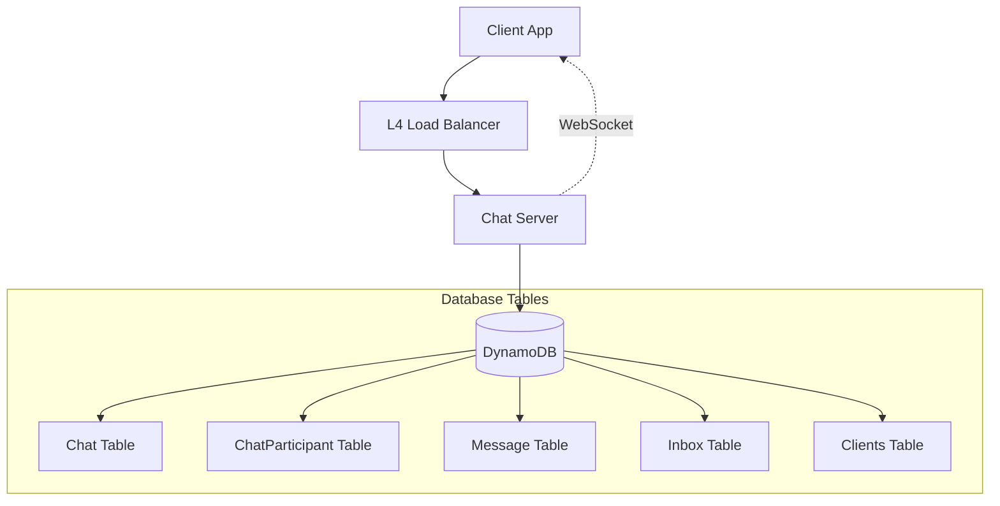
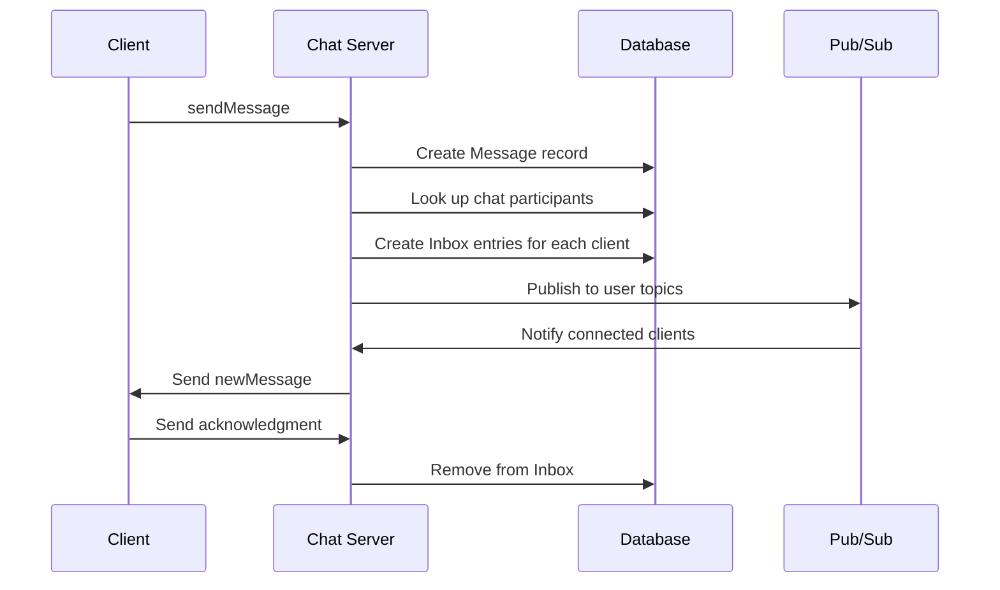
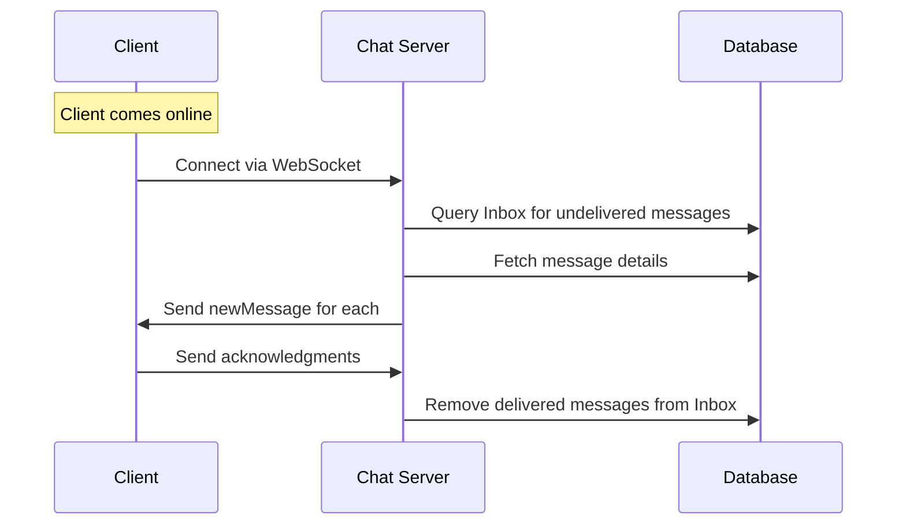
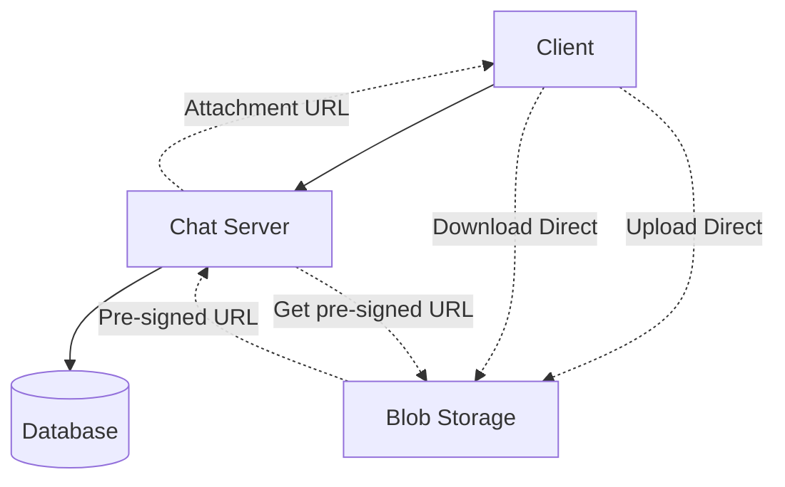
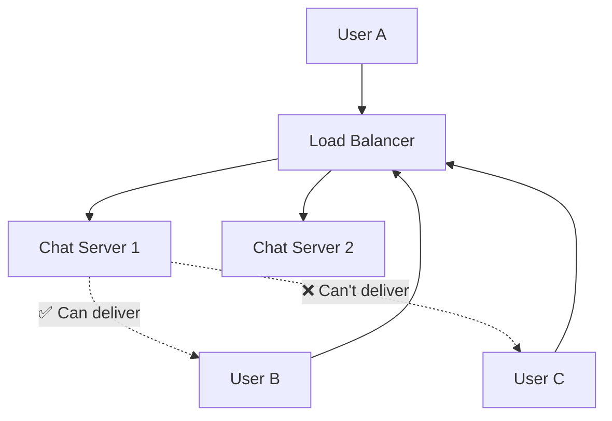
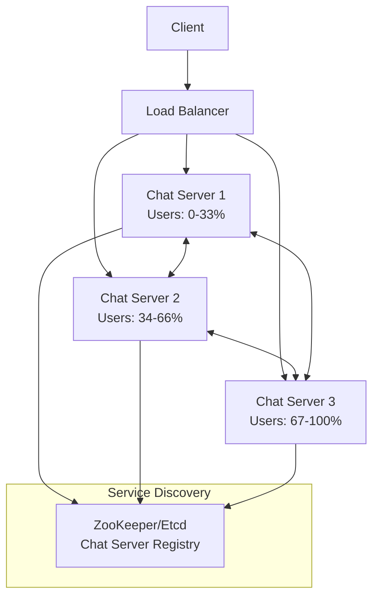
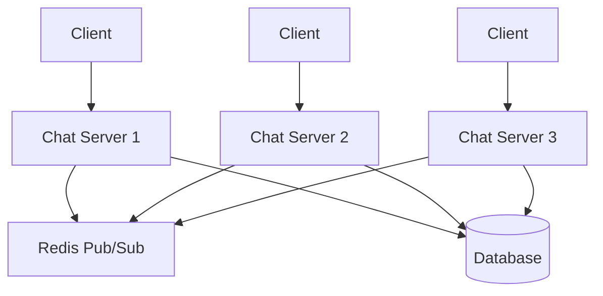
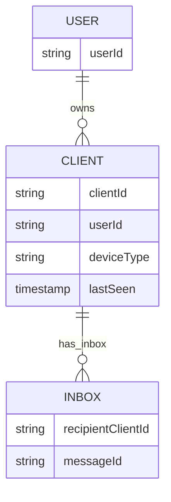

# WhatsApp System Design Interview Guide

## 📋 Understanding the Problem

### What is WhatsApp?

WhatsApp is a messaging service that allows users to send and receive **encrypted messages** and calls from their phones and computers. Originally built on Erlang, it's renowned for handling high scale with limited engineering and infrastructure outlay.

## 🎯 Requirements Analysis

### Functional Requirements (Core Features)

1. **Group Chats**: Users can start group chats with multiple participants (limit 100)
2. **Send/Receive Messages**: Real-time messaging capabilities
3. **Offline Message Storage**: Users can receive messages sent while offline (up to 30 days)
4. **Media Support**: Users can send/receive media in messages

### Out of Scope (Below the Line)

- Audio/Video calling
- Interactions with businesses
- Registration and profile management
- Exhaustive security concerns
- Spam and scraping prevention

### Non-Functional Requirements

- **Low Latency**: Messages delivered to available users < 500ms
- **Guaranteed Delivery**: Messages should reach users reliably
- **High Scale**: Handle billions of users with high throughput
- **Data Retention**: Messages stored centrally only as long as necessary
- **Fault Tolerance**: Resilient against individual component failures

## 🏗️ Core Entities



## 🔌 API Design: WebSocket Commands

### Why WebSockets?

- **Bi-directional communication** for real-time updates
- **Persistent connections** for low latency
- **Efficient** for high-frequency message exchanges

### Commands Sent (Client → Server)

```json
// Create Chat
{
  "command": "createChat",
  "participants": ["userId1", "userId2"],
  "name": "Chat Name"
}
→ { "chatId": "chat123" }

// Send Message
{
  "command": "sendMessage",
  "chatId": "chat123",
  "message": "Hello World",
  "attachments": ["attachment1"]
}
→ "SUCCESS" | "FAILURE"

// Modify Participants
{
  "command": "modifyChatParticipants",
  "chatId": "chat123",
  "userId": "user456",
  "operation": "ADD" | "REMOVE"
}
→ "SUCCESS" | "FAILURE"
```

### Commands Received (Server → Client)

```json
// New Message
{
  "command": "newMessage",
  "chatId": "chat123",
  "userId": "user789",
  "message": "Hello!",
  "attachments": []
}
→ "RECEIVED" (acknowledgment)

// Chat Update
{
  "command": "chatUpdate",
  "chatId": "chat123",
  "participants": ["user1", "user2", "user3"]
}
→ "RECEIVED" (acknowledgment)
```

## 🏛️ High-Level Architecture

### Initial Simple Design



### Database Schema Design

#### Chat Table

- **Primary Key**: chatId
- **Attributes**: name, metadata, createdAt

#### ChatParticipant Table

- **Primary Key**: chatId + participantId (composite)
- **GSI**: participantId (to find all chats for a user)

#### Message Table

- **Primary Key**: messageId
- **Attributes**: chatId, creatorId, content, attachments, timestamp

#### Inbox Table

- **Primary Key**: recipientClientId + messageId
- **Purpose**: Track undelivered messages per client

## 📨 Message Flow

### Sending a Message



### Offline Message Delivery



## 📁 Media Attachments

### ❌ Bad Solution: Store in Database

- Databases not optimized for large binary blobs
- Wastes Chat Server bandwidth
- Poor performance

### ✅ Great Solution: Separate Blob Storage



**Flow:**

1. Client requests `getAttachmentTarget` → receives pre-signed URL
2. Client uploads directly to blob storage
3. Client sends attachment URL to Chat Server
4. Recipients get pre-signed URLs to download

## ⚡ Scaling Challenges & Solutions

### Problem: Single Chat Server Won't Scale

- Need to support **billions of users**
- **200M+ concurrent connections** expected
- WhatsApp served **1-2M users per host**

### ❌ Bad Solution: Naive Horizontal Scaling



**Problem**: Users on different servers can't communicate!

### ✅ Solution 1: Consistent Hashing



**Pros**: Direct server-to-server communication
**Cons**: All-to-all connections, complex scaling orchestration

### ✅ Solution 2: Pub/Sub (Recommended)



**How it works:**

1. **Connection**: When user connects, Chat Server subscribes to `userId` topic
2. **Message Send**: Publish message to recipient's `userId` topic
3. **Message Receive**: All subscribing Chat Servers get message, forward to WebSocket
4. **Durability**: Inbox table handles persistence for offline users

**Benefits:**

- **Decoupled** architecture
- **At-most-once** delivery (OK because we have Inbox for durability)
- **Easy scaling** - just add more Chat Servers

## 👥 Multiple Clients per User

### Challenge

Users have multiple devices: phone, tablet, laptop, etc.

### Solution: Client-Level Tracking



**Changes needed:**

- **Clients Table**: Track each device separately
- **Inbox per Client**: Instead of per-user inbox
- **Message Delivery**: Send to all active clients for a user
- **Limit**: ~3 clients per user to control storage

## 🎭 Interview Expectations by Level

### Mid-Level (L4/E4) - 80% Breadth, 20% Depth

**Focus**: Functional high-level design

- ✅ Define clear API and requirements
- ✅ Create working high-level architecture
- ✅ Basic understanding of components (WebSockets, databases)
- ⚠️ Scaling solution may have rough edges
- ⚠️ Interviewer will guide deep dives

### Senior (L5/E5) - 60% Breadth, 40% Depth

**Focus**: Advanced system design + proactive problem solving

- ✅ Speed through initial design to focus on scaling
- ✅ Deep knowledge of consistent hashing, pub/sub patterns
- ✅ Articulate pros/cons of architectural choices
- ✅ Proactively identify bottlenecks and solutions
- ✅ Understand WebSocket mechanics and real-time patterns

### Staff+ (L6+) - 40% Breadth, 60% Depth

**Focus**: Expert-level depth + independent problem solving

- ✅ Breeze through basics to focus on complex scenarios
- ✅ 2-3 levels deep on failure modes and optimizations
- ✅ Discuss fault tolerance, database optimization, regionalization
- ✅ Cell-based architecture and advanced scaling patterns
- ✅ Minimal interviewer intervention needed

## 🔧 Additional Deep Dive Topics

### Connection Management

- **Heartbeats** for connection health
- **Graceful reconnection** strategies
- **Connection pooling** optimizations

### Last Seen Feature

- Update user presence on message send/receive
- Periodic heartbeat updates
- Privacy controls (hide last seen)

### Security Considerations

- **End-to-end encryption** for message content
- **Authentication** and session management
- **Rate limiting** to prevent abuse

### Performance Optimizations

- **Message batching** for high-volume chats
- **Connection pooling** between services
- **Caching** frequently accessed data
- **Database sharding** strategies

### Monitoring & Observability

- **Message delivery metrics** (latency, success rate)
- **Connection health** monitoring
- **Pub/Sub performance** tracking
- **Database performance** metrics

## 💡 Key Takeaways

1. **Start Simple**: Single-host solution first, then scale
2. **WebSockets**: Essential for real-time bidirectional communication
3. **Inbox Pattern**: Crucial for reliable offline message delivery
4. **Pub/Sub**: Elegant solution for scaling message routing
5. **Separate Concerns**: Handle media uploads separately from messaging
6. **Client Granularity**: Track devices separately, not just users
7. **Acknowledge Everything**: Client acknowledgments ensure delivery
8. **Plan for Scale**: Billion+ users require careful architectural choices

## 🎯 Common Pitfalls to Avoid

- ❌ Storing media in database
- ❌ Using REST API instead of WebSockets
- ❌ Forgetting offline message delivery
- ❌ Not planning for multiple devices per user
- ❌ Ignoring message acknowledgments
- ❌ Over-engineering the initial solution
- ❌ Using Kafka topics per user (doesn't scale)

Remember: **Focus on the pattern, not just WhatsApp** - these real-time messaging patterns apply to many systems!

# WhatsApp System Design - Last Minute Revision

## 🎯 Core Requirements (30 seconds)

• **Functional**: Group chats (100 users), send/receive messages, offline storage (30 days), media support
• **Non-Functional**: <500ms latency, guaranteed delivery, billions of users, fault tolerance
• **Out of Scope**: Audio/video calls, business interactions, registration, security details

## 🏗️ Essential Architecture Components (1 minute)

• **WebSockets**: Bi-directional real-time communication (NOT REST API)
• **Key Tables**: Chat, ChatParticipant, Message, Inbox, Clients
• **Inbox Pattern**: Critical for offline message delivery and guaranteed delivery
• **Client-Level Tracking**: Each device gets separate clientId and inbox

## 📨 Message Flow Pattern (1 minute)

• **Send**: Client → Server → Create Message → Create Inbox entries → Pub/Sub → Notify recipients
• **Receive**: Server → Client via WebSocket → Client sends ACK → Remove from Inbox
• **Offline**: Query Inbox on reconnect → Send all undelivered → Remove on ACK

## ⚡ Scaling Solutions (2 minutes)

• **Problem**: Single server can't handle billions of users
• **Bad**: Naive horizontal scaling (users can't talk across servers)
• **Good**: Consistent hashing with server-to-server communication
• **Best**: **Pub/Sub pattern** with Redis - servers subscribe to userId topics
• **Why Pub/Sub**: Decoupled, easy scaling, at-most-once delivery (Inbox provides durability)

## 📁 Media Handling (30 seconds)

• **Never**: Store media in database (waste of bandwidth/performance)
• **Always**: Separate blob storage with pre-signed URLs
• **Flow**: Client gets upload URL → uploads direct → sends attachment URL to server

## 🎭 Interview Level Expectations (1 minute)

• **L4/E4**: Focus on basic architecture, interviewer guides scaling discussion
• **L5/E5**: Speed through basics, deep dive on pub/sub vs consistent hashing tradeoffs
• **L6+**: Expert depth on fault tolerance, optimization, minimal guidance needed

## 🔧 Key Deep Dive Topics (1 minute)

• **Connection Management**: Heartbeats, reconnection, WebSocket lifecycle
• **Multiple Clients**: Each device separate, ~3 client limit per user
• **Last Seen**: Update on message activity, privacy controls
• **Fault Tolerance**: Handle server failures, message durability
• **Optimizations**: Batching, caching, database sharding

## ❌ Common Pitfalls to Avoid (30 seconds)

• Using REST instead of WebSockets
• Storing media in database
• Forgetting offline message delivery
• Not planning for multiple devices per user
• Missing message acknowledgments
• Over-engineering initial solution
• Using Kafka topics per user (doesn't scale)

## 🎯 Key Success Patterns (1 minute)

• **Start Simple**: Single server first, then scale
• **Inbox Pattern**: Guarantees delivery + handles offline
• **Pub/Sub**: Elegant scaling solution for real-time systems
• **Client Granularity**: Track devices, not just users
• **Acknowledge Everything**: Ensures reliable delivery
• **Separate Concerns**: Media ≠ messaging infrastructure

## 🚀 Quick Win Talking Points (30 seconds)

• WhatsApp famously served 1-2M users per host with minimal infrastructure
• WebSocket persistent connections are key for <500ms latency
• Pub/Sub pattern is industry standard for real-time messaging at scale
• Inbox pattern solves the "message delivered while offline" challenge elegantly
• Client-level tracking handles modern multi-device reality

**Remember**: Focus on the messaging patterns, not just WhatsApp specifics - these apply to Slack, Discord, Teams, etc!
