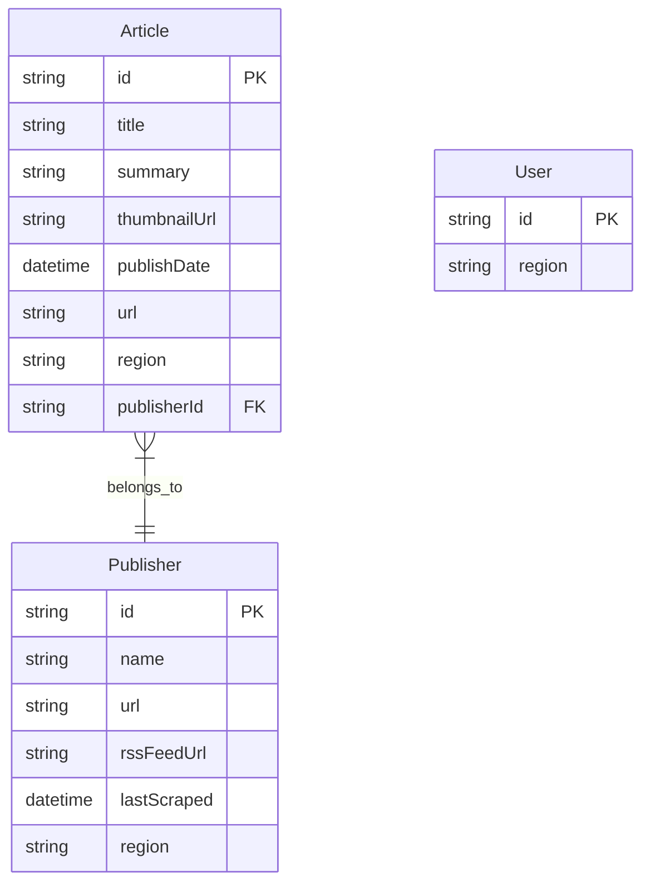
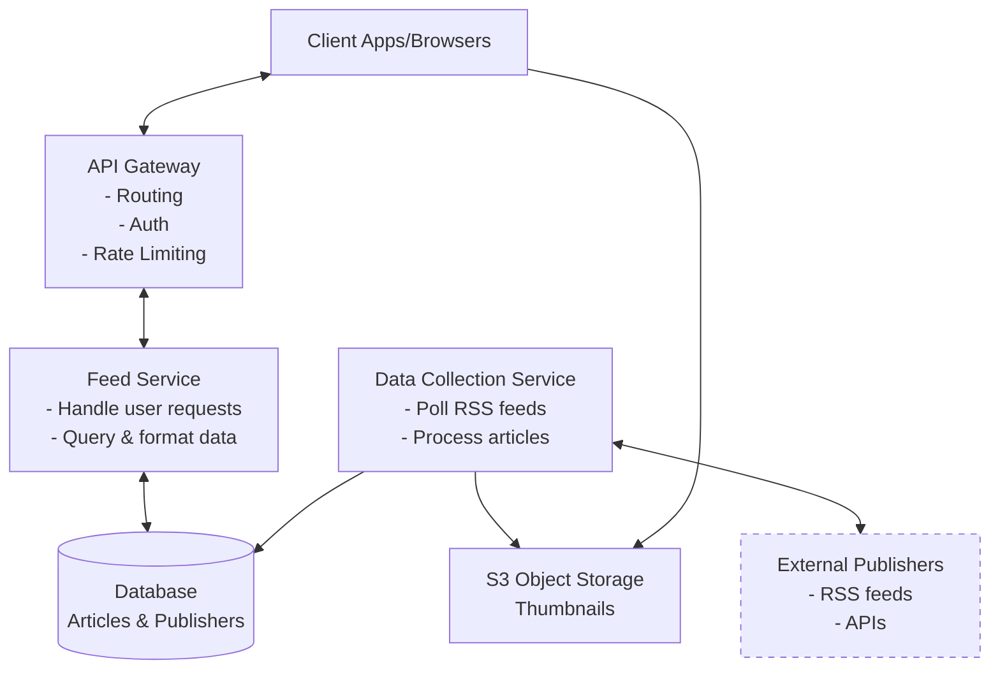
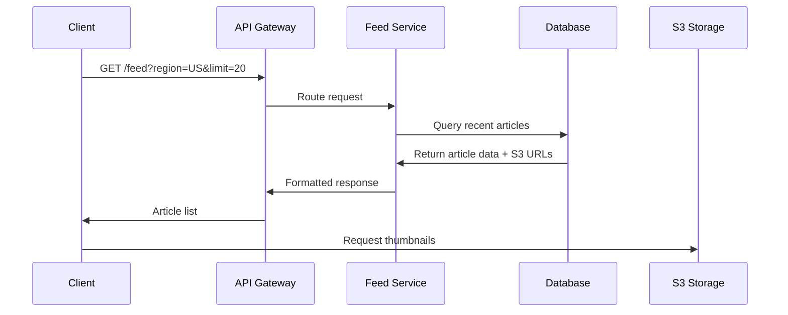
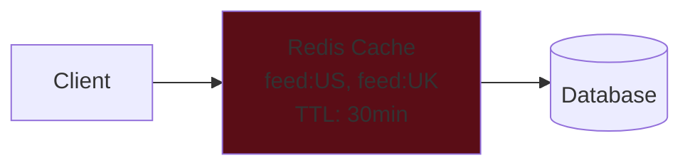
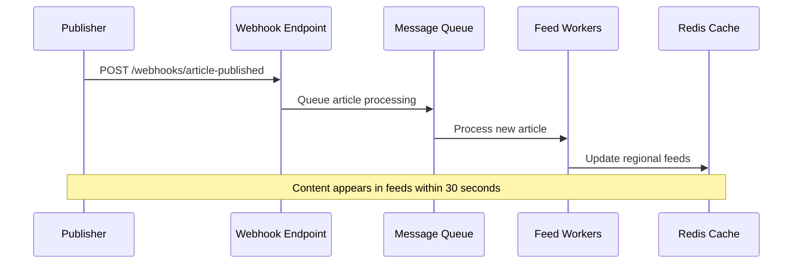
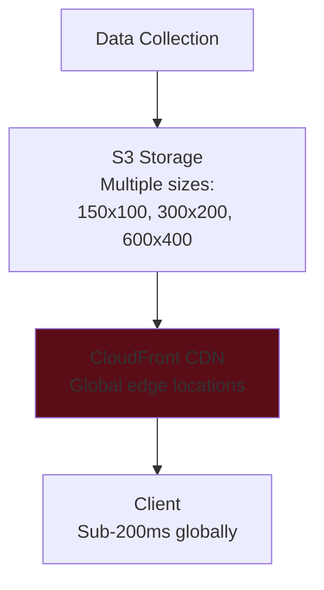
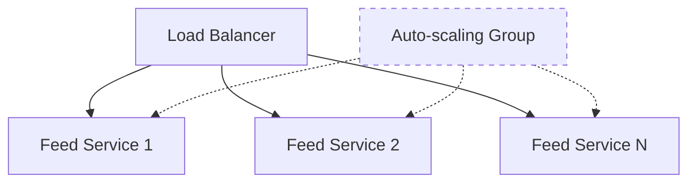

```mermaid
graph TB
    DataCollection[Data Collection<br/>Service]
    CDC[Change Data Capture]
    Workers[Feed Generation<br/>Workers]
    Redis[Redis Sorted Sets<br/>feed:US, feed:UK<br/>Recent 1000 articles]

    DataCollection --> DB[(Database)]
    DB --> CDC
    CDC --> Workers
    Workers --> Redis

    Client --> Redis

    style Redis fill:#1E4C50
```

# Google News System Design - Interview Guide

## 📰 Problem Understanding

**What is Google News?**

- Digital service that aggregates and displays news articles from thousands of publishers worldwide
- Provides a scrollable interface for users to stay updated on current events
- Acts as an aggregator (doesn't host content, redirects to publisher websites)

## 🎯 Requirements

### Functional Requirements

#### Core Requirements

1. **View aggregated feed** - Users can view news articles from thousands of publishers worldwide
2. **Infinite scroll** - Users can scroll through the feed continuously
3. **Click-through** - Users can click articles and be redirected to publisher websites

#### Below the Line (Out of Scope)

- Customize feed based on interests
- Save articles for later reading
- Share articles on social media

### Non-Functional Requirements

#### Core Requirements

1. **Availability > Consistency** (CAP theorem) - Users prefer slightly outdated content over no content
2. **Scale** - Handle 100M daily active users with spikes up to 500M
3. **Low Latency** - Feed load times < 200ms

#### Below the Line (Out of Scope)

- User data privacy protection
- Traffic spike handling during breaking news
- Monitoring and observability
- Publisher API failure resilience

## 🏗️ Core Entities



## 🔌 API Design

```
GET /feed?page={page}&limit={limit}&region={region} -> Article[]
```

**Note:** No specific article endpoint needed - browser redirects to publisher URL directly.

## 🏛️ High-Level Architecture



### Component Responsibilities

#### Data Collection Service

- **Purpose**: Background process to gather content from publishers
- **Process**:
  1. Query database for publisher RSS URLs
  2. Poll each feed every 3-6 hours
  3. Extract article content and metadata
  4. Download and store thumbnails in S3
  5. Store article data in database

#### Feed Service

- **Purpose**: Handle user feed requests
- **Process**:
  1. Receive feed requests via API Gateway
  2. Query database for recent articles by region
  3. Format and return response
- **Separation Rationale**: Different scaling (read vs write), update frequencies, operational needs

### Request Flow



## 🔥 Deep Dives & Scaling Solutions

### 1. Pagination Consistency

#### Problem

- Offset-based pagination breaks when new articles are published
- Users see duplicates or miss content during scrolling

#### Solutions

**❌ Bad: Offset-based Pagination**

```sql
SELECT * FROM articles ORDER BY published_at DESC LIMIT 20 OFFSET 40;
```

**✅ Good: Timestamp-based Cursors**

```sql
SELECT * FROM articles
WHERE published_at < '2024-01-15T10:30:00Z'
ORDER BY published_at DESC LIMIT 20;
```

**🌟 Great: Monotonically Increasing IDs**

```sql
SELECT * FROM articles
WHERE article_id < 'cursor_id'
ORDER BY article_id DESC LIMIT 20;
```

- Use ULIDs (time-ordered UUIDs)
- Simplest and most performant
- No timestamp collision issues

### 2. Low Latency (< 200ms) Feeds

#### Problem

- 100M+ users × 5-10 requests/day = 500M-1B database queries
- Direct database queries too slow

#### Solutions

**✅ Good: Redis Cache with TTL**



**🌟 Great: Real-time CDC Updates**



- **Workflow**: New article → Database → CDC event → Workers update Redis immediately
- **Benefits**: Sub-5ms reads, always fresh content, no thundering herd

### 3. Fast Content Discovery (< 30min)

#### Problem

- Polling every 3-6 hours too slow for breaking news
- Users learn from social media first

#### Solutions

**✅ Good: Increased Polling**

- High-priority publishers: 5-10 minutes
- Medium priority: 30 minutes
- Low priority: 2-3 hours

**✅ Good: Web Scraping**

- For publishers without RSS feeds
- Maintain CSS selectors for each site
- Extract content directly from HTML

**🌟 Great: Publisher Webhooks**



### 4. Media Content Optimization

#### Problem

- 100M+ users viewing thumbnails daily
- Need fast, global delivery

#### Solutions

**❌ Bad: Database Blob Storage**

- Kills database performance
- Massive storage overhead

**✅ Good: S3 Storage**

- Separate concerns properly
- Direct browser loading

**🌟 Great: CDN + Multiple Sizes**



### 5. Traffic Spike Handling (10M Concurrent Users)

#### Regional Deployment Strategy

- News consumption is inherently regional
- Deploy separate infrastructure per region
- Each handles local traffic only

#### Component Scaling

**Feed Service (Application Layer)**



**Cache Layer (Redis Scaling)**

```mermaid
graph TB
    Write[Write Operations] --> Master[Redis Master<br/>~2000 articles/region]
    Master --> R1[Replica 1]
    Master --> R2[Replica 2]
    Master --> RN[Replica N]

    Reads[Read Operations<br/>10M users] --> LB[Load Balancer]
    LB --> R1
    LB --> R2
    LB --> RN

    style Master fill:#5A0D16
    style R1 fill:#1E4C50
    style R2 fill:#5A0D16
    style RN fill:#1E4C50
```



**Scaling Math**: 10M users ÷ 100k req/sec per Redis = 100 Redis instances needed

## 🎯 Bonus Deep Dives

### 6. Category-Based Feeds

#### Problem

- Users want Sports, Politics, Tech, etc.
- Current regional feeds insufficient

#### Solutions

**❌ Bad: Real-time Database Filtering**

```sql
SELECT * FROM articles
WHERE region = 'US' AND category = 'sports'
ORDER BY published_at DESC;
```

**✅ Good: Pre-computed Category Feeds**

- Separate Redis sorted sets: `feed:sports:US`, `feed:politics:UK`
- Memory intensive but fast

**🌟 Great: In-memory Filtering**

- Cache complete article metadata in regional feeds
- Filter in application memory (1-2ms overhead)
- Minimal memory increase, simple architecture

### 7. Personalized Feeds

#### Problem

- Same regional feed for all users
- Modern platforms need personalization

#### Solutions

**❌ Bad: Real-time Scoring**

- Billions of calculations per hour
- Destroys latency requirements

**✅ Good: Pre-computed User Caches**

- Dedicated Redis feeds per user: `feed:user:12345`
- Memory explosion for 100M users

**🌟 Great: Hybrid Dynamic Assembly**



```mermaid
graph LR
    UserProfile[User Preference Vector<br/>Lightweight KB per user]
    TechFeed[feed:technology:US<br/>60%]
    BusinessFeed[feed:business:US<br/>30%]
    TrendingFeed[feed:trending:US<br/>10%]

    UserProfile --> Assembly[Dynamic Assembly]
    TechFeed --> Assembly
    BusinessFeed --> Assembly
    TrendingFeed --> Assembly
    Assembly --> PersonalizedFeed[Personalized Feed]

    style Assembly fill:#1E4C50
```

## 🛠️ Technology Choices

### Database

- **Primary**: PostgreSQL with proper indexing
- **Why not Elasticsearch**: Overkill for chronological sorting, higher latency than Redis

### Cache

- **Redis Sorted Sets**: O(log N) operations, microsecond latency
- **Alternative**: Any distributed cache with sharding

### Storage

- **S3 + CloudFront**: Global CDN, multiple image sizes
- **Regional deployment**: Better than global single region

## 🔍 Key Interview Points

### Questions to Ask Interviewer

1. Can I black box the ingestion pipeline?
2. Do publishers maintain RSS feeds?
3. Can we assume webhook cooperation given our traffic?
4. What's the priority: global vs regional deployment?

### Scaling Patterns to Highlight

- **Read-heavy workload**: Aggressive caching essential
- **Regional deployment**: Easier scaling than global
- **Separation of concerns**: Read vs write services
- **Cursor-based pagination**: Better than offset
- **CDC pattern**: Real-time cache updates

### Common Mistakes to Avoid

- Database blob storage for images
- Real-time scoring for personalization
- Offset-based pagination at scale
- Single global deployment
- Elasticsearch for simple chronological data

## 📊 Numbers to Remember

- **Scale**: 100M DAU, spikes to 500M
- **Latency**: < 200ms feed loads
- **Discovery**: < 30 minutes for new articles
- **Redis throughput**: ~100k requests/second
- **Regional articles**: ~1000-2000 cached per region
- **Polling frequency**: 5-10 min (high priority), 30 min (medium), 2-3 hours (low)

## 🎯 Practice Questions

1. How would you handle a publisher going down?
2. What if we need to support 1000+ categories?
3. How to detect and prevent duplicate articles?
4. What's your strategy for handling different time zones?
5. How would you implement trending/breaking news detection?

---

**Remember**: Start simple, build incrementally, and always justify your scaling decisions with concrete numbers and trade-offs!
