# Gopuff System Design Interview Guide

## Problem Statement
Design a local delivery service like Gopuff that delivers convenience store goods via rapid delivery from 500+ micro distribution centers (DCs).

## 1. Requirements Gathering

### Functional Requirements (Core)
1. **Query Availability**: Customers can query item availability by location (within 1-hour delivery)
2. **Place Orders**: Customers can order multiple items simultaneously
3. **Location-Based Service**: Effective availability is the union of all inventory from nearby DCs

### Functional Requirements (Out of Scope)
- Payments/purchases
- Driver routing and deliveries
- Search functionality and catalog APIs
- Cancellations and returns

### Non-Functional Requirements (Core)
1. **Performance**: Availability requests < 100ms (for search use-cases)
2. **Consistency**: Strong consistency for ordering (no double booking)
3. **Scale**: Support 10k DCs and 100k items in catalog
4. **Volume**: Handle ~10M orders/day

### Non-Functional Requirements (Out of Scope)
- Privacy and security
- Disaster recovery

## 2. Core Entities


**Key Distinction**: 
- **Item**: Catalog entity (e.g., "Cheetos") - what customers see
- **Inventory**: Physical instances at specific DCs - what we track for availability

## 3. API Design

### Availability API
```http
GET /v1/availability?lat={LAT}&long={LONG}&keyword={}&page_size={}&page_num={}

Response:
{
  "items": [
    {
      "name": "Cheetos",
      "quantity": 15
    }
  ]
}
```

### Order API
```http
POST /v1/order
{
  "lat": 40.7128,
  "long": -74.0060,
  "items": ["item1", "item2", "item3"],
  "user_id": "user123"
}

Response: Order | Failure
```

## 4. High-Level Architecture

```mermaid
graph TB
    User[👤 User] --> Gateway[API Gateway]
    
    Gateway --> AvailabilityService[Availability Service]
    Gateway --> OrderService[Order Service]
    
    AvailabilityService --> NearbyService[Nearby Service]
    AvailabilityService --> InventoryDB[(Inventory DB)]
    
    OrderService --> NearbyService
    OrderService --> InventoryDB
    
    NearbyService --> TravelTimeService[Travel Time Service]
    NearbyService --> DCTable[(DC Table)]
    
    InventoryDB --> ReadReplicas[(Read Replicas)]
    
    subgraph "Database Layer"
        InventoryDB
        ReadReplicas
        DCTable
    end
    
    subgraph "External Services"
        TravelTimeService
    end
```



## 5. Availability Flow


## 6. Order Processing (Strong Consistency)

### Approach: Single PostgreSQL Transaction


**Benefits**:
- Leverages PostgreSQL ACID properties
- Atomic transactions prevent double booking
- Simple to implement and maintain

**Trade-offs**:
- Couples inventory and orders scaling
- Single point of failure
- Less optimal data store usage per use case

## 7. Deep Dive: Nearby DC Service Evolution

### Bad Solution: Simple SQL Distance


**Problems**: Doesn't account for traffic, roads, or real travel time

### Good Solution: Travel Time Service


**Improvements**:
- Pre-filter candidates by distance to reduce API calls
- Cache DC data in memory (rarely changes)
- Use real travel time estimates

## 8. Deep Dive: Scaling Read-Heavy Workload

### Traffic Estimation
```
Orders: 10M/day
Pages viewed per purchase: 10
Conversion rate: 5%
Available requests: 10M × 10 ÷ 0.05 = 2B/day ≈ 20k QPS
```

### Scaling Pattern: Read Replicas + Caching


### Cache Strategy
- **Redis caching** with 1-minute TTL
- **Cache invalidation** when orders update inventory
- **Regional partitioning** to limit query scope

## 9. Interview Performance by Level

### Mid-Level (80% Breadth, 20% Depth)
**Expected Deliverables**:
- ✅ Clear API endpoints and data model
- ✅ Basic availability and ordering flows
- ✅ Simple solutions acceptable with good discussion
- ⚠️ May need interviewer guidance for optimizations

### Senior (60% Breadth, 40% Depth)
**Expected Deliverables**:
- ✅ Optimized solutions for critical paths
- ✅ Proactive identification of bottlenecks
- ✅ Trade-off discussions for architectural decisions
- ✅ Atomic transaction design for ordering
- ✅ Scaling solutions for availability service

### Staff+ (40% Breadth, 60% Depth)
**Expected Deliverables**:
- ✅ Deep dive into 2-3 key areas
- ✅ Innovative thinking and optimal solutions
- ✅ Real-world experience application
- ✅ Anticipation of edge cases and failure modes
- ✅ Unique insights that teach the interviewer

## 10. Key Technical Decisions & Trade-offs

### Database Strategy
**Decision**: Single PostgreSQL with read replicas
**Pros**: 
- ACID compliance for orders
- Simpler transaction management
- Proven reliability

**Cons**: 
- Coupled scaling
- Single point of failure
- Less optimal per use case

### Caching Strategy
**Decision**: Redis with short TTL + cache invalidation
**Why**: 
- 20k QPS requires caching
- Inventory changes frequently
- Acceptable eventual consistency for reads

### Nearby DC Resolution
**Decision**: In-memory cache + travel time API
**Why**: 
- DCs rarely change (buildings don't move)
- Real travel time more accurate than distance
- Pre-filtering reduces API costs

## 11. Potential Follow-up Questions

### Scaling Challenges
- How to handle DC outages?
- Managing inventory across multiple regions?
- Handling traffic spikes during events?

### Business Logic
- How to handle substitutions?
- Priority ordering for high-value customers?
- Inventory reservation vs. best-effort approach?

### Data Consistency
- Eventually consistent reads vs. strong consistency needs?
- Cross-DC inventory management?
- Handling partial order failures?

## 12. Common Pitfalls to Avoid

1. **Over-engineering early**: Start simple, then optimize
2. **Ignoring the read-heavy pattern**: Availability queries >> orders
3. **Not considering geography**: DCs are location-bound
4. **Forgetting about double-booking**: Strong consistency is required
5. **Missing quantitative analysis**: Always estimate scale and QPS

## 13. Key Patterns Demonstrated

- **Scaling Reads**: Cache-aside pattern with read replicas
- **Geographic Distribution**: Location-based service partitioning  
- **ACID Transactions**: Using database transactions for consistency
- **API Design**: RESTful endpoints with proper pagination
- **Data Modeling**: Separating catalog (Item) from physical inventory

---

**💡 Interview Tips**:
- Always start with functional requirements
- Estimate scale early and often
- Be opinionated about technical choices
- Draw diagrams while explaining
- Ask clarifying questions throughout