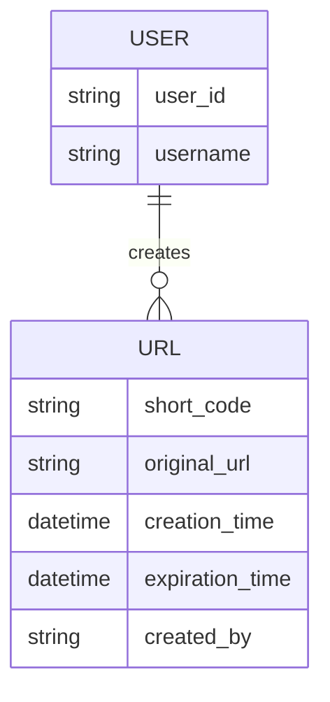
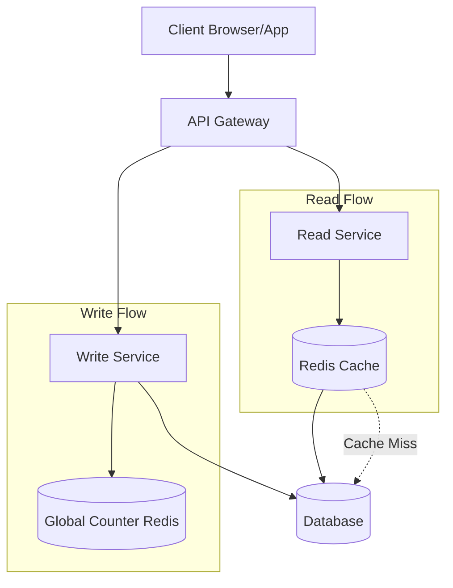
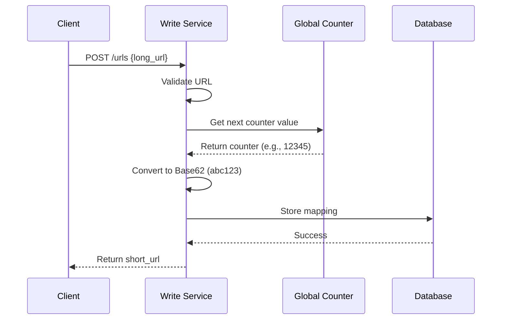
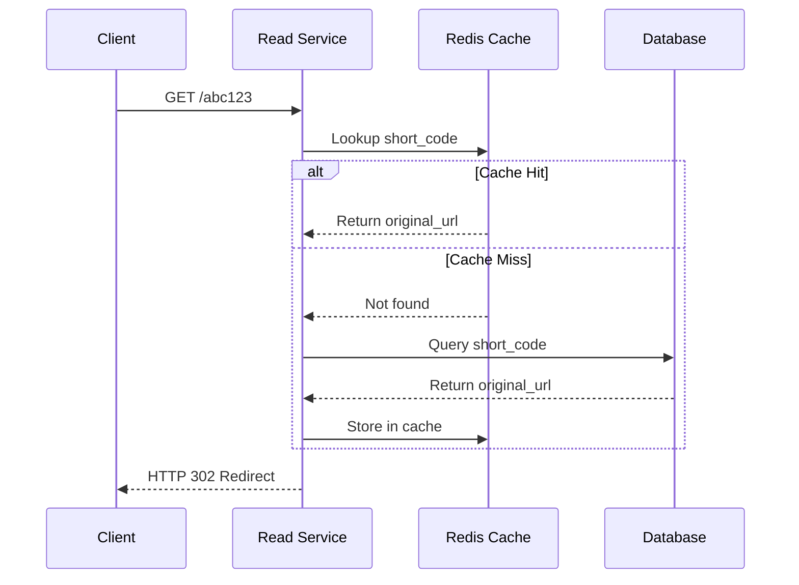
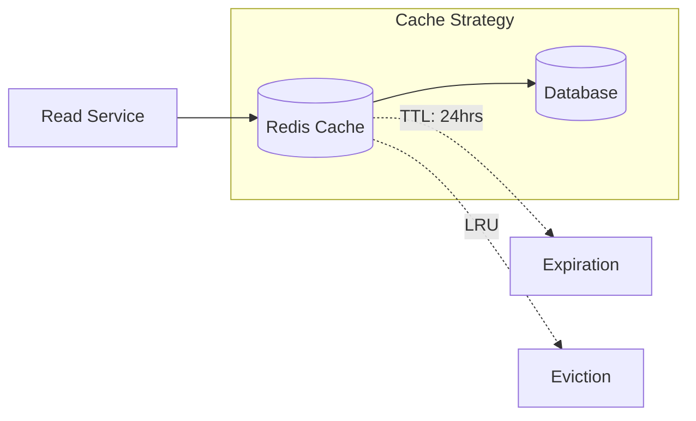
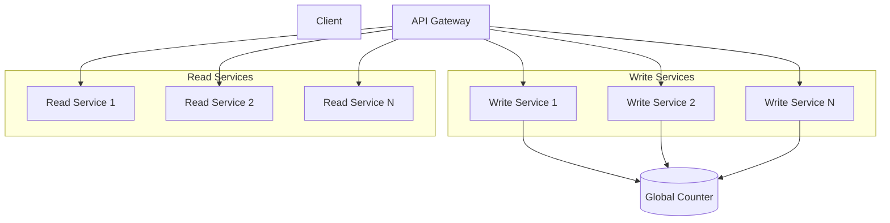
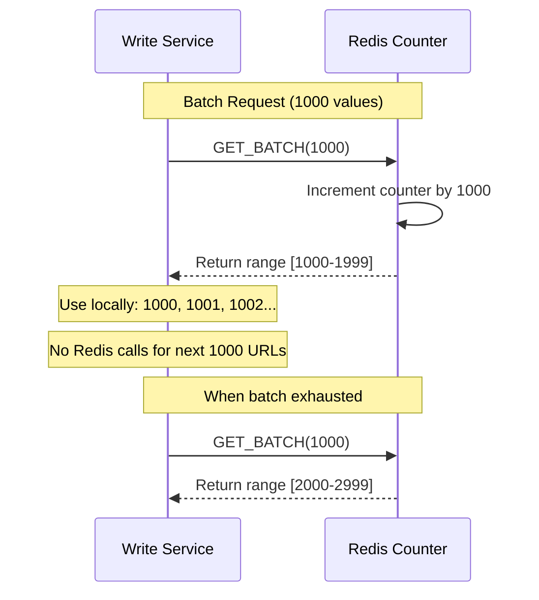
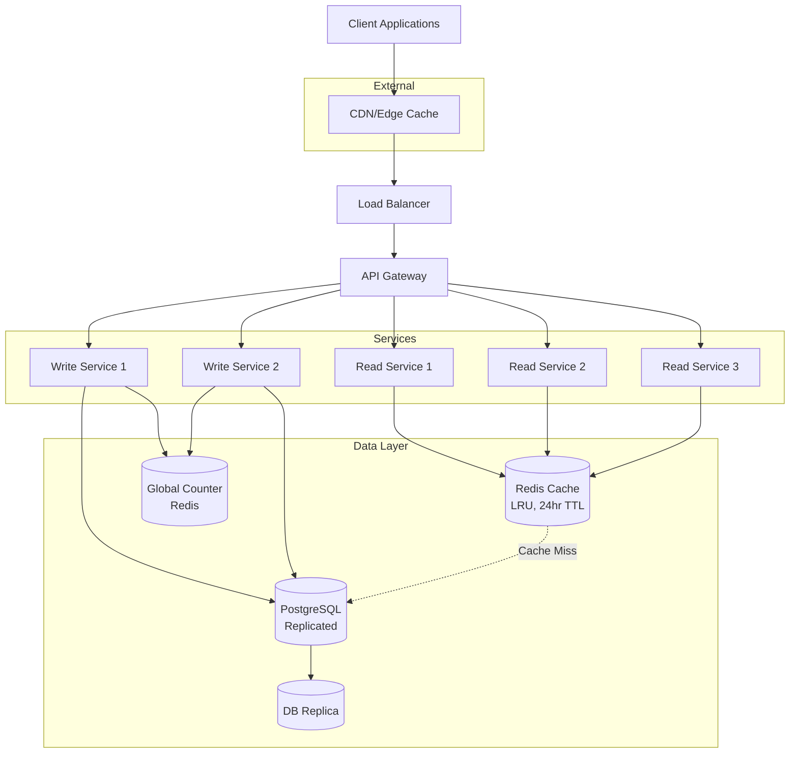

# URL Shortener System Design - Interview Guide

## 📋 Problem Overview
Design a URL shortening service like Bit.ly that converts long URLs into shorter, manageable links and provides analytics.

**Key Insight**: This is a **read-heavy system** with a 1000:1 read-to-write ratio (1000 clicks per 1 URL creation).

---

## 🎯 Functional Requirements

### ✅ Core Requirements (In Scope)
1. **URL Shortening**: Users can submit long URLs and receive shortened versions
   - Optional: Custom alias support
   - Optional: Expiration date setting
2. **URL Redirection**: Users can access original URLs via shortened URLs

### ❌ Below the Line (Out of Scope)
- User authentication and account management
- Analytics on link clicks (geographic data, click counts)
- Advanced security (spam detection, malicious URL filtering)

---

## ⚡ Non-Functional Requirements

### Core Requirements
1. **Uniqueness**: Ensure short codes are globally unique
2. **Low Latency**: Redirection should occur within 100ms
3. **High Availability**: 99.99% uptime (Availability > Consistency)
4. **Scalability**: Support 1B shortened URLs and 100M DAU

### Important Considerations
- **Read-to-Write Ratio**: 1000:1 (heavily read-skewed)
- **Data Consistency**: Real-time analytics not critical
- **Security**: Basic validation, advanced features out of scope

---

## 🏗️ Core Entities



---

## 🔌 API Design

### 1. Shorten URL
```http
POST /urls
Content-Type: application/json

{
  "long_url": "https://www.example.com/some/very/long/url",
  "custom_alias": "optional_custom_alias",
  "expiration_date": "optional_expiration_date"
}

Response:
{
  "short_url": "http://short.ly/abc123"
}
```

### 2. Redirect to Original URL
```http
GET /{short_code}

Response:
HTTP/1.1 302 Found
Location: https://www.original-long-url.com
```

**Why 302 over 301?**
- 302 (Temporary): Browsers don't cache, ensures traffic goes through our servers
- Allows tracking, link updates, and expiration handling
- 301 (Permanent): Browsers cache, bypassing our servers

---

## 🏛️ High-Level Architecture



---

## 🔄 System Flows

### URL Creation Flow


### URL Redirection Flow


---

## 🔧 Deep Dive: Short Code Generation

### ❌ Bad Solution: URL Prefix
**Approach**: Take first N characters of the input URL as short code.
- Example: `www.linkedin.com/in/evan-king/` → `www.link`

**Problems**:
- **No Uniqueness**: Multiple URLs with same prefix map to same short code
- **Collision Resolution**: No way to distinguish between different URLs
- **Predictable**: Not suitable for production systems

### ✅ Good Solution: Random Number Generator / Hash Function

#### Random Number Generator Approach
```javascript
input_url = "https://www.example.com/some/very/long/url"
random_number = Math.random()
short_code_encoded = base62_encode(random_number)
short_code = short_code_encoded.slice(0, 8) // 8 characters
```

#### Hash Function Approach
- Use cryptographic hash functions (SHA-256, MD5)
- Same input always produces same hash
- High entropy and randomness

**Pros**:
- Simple to implement
- Good entropy/randomness
- Hash functions provide deterministic results

**Cons**:
- **Birthday Problem**: Collision probability increases with more URLs
- **Collision Detection**: Requires database checks for each new code
- **Trade-off**: Longer codes vs. collision probability
- **Scalability Issues**: Checking becomes bottleneck

### 🌟 Great Solution: Counter + Base62 Encoding

**Why Base62?**
- Characters: `a-z, A-Z, 0-9` (62 total characters)
- URL-safe (no special characters)
- Compact representation

**Length Analysis:**
- 6 characters: 62^6 = ~57 billion URLs
- 7 characters: 62^7 = ~3.5 trillion URLs

**Implementation:**
```python
def int_to_base62(num):
    if num == 0:
        return '0'
    
    alphabet = '0123456789abcdefghijklmnopqrstuvwxyzABCDEFGHIJKLMNOPQRSTUVWXYZ'
    result = ''
    
    while num > 0:
        result = alphabet[num % 62] + result
        num //= 62
    
    return result

# Example: counter = 12345 → short_code = "dnh"
```

---

## 🚀 Scaling Strategies

### 1. Read Scaling (Critical for 1000:1 ratio)

#### Database Indexing
**B-tree Indexing** (Default for most databases):
```sql
CREATE INDEX idx_short_code ON urls(short_code);
-- Provides O(log n) lookup time
```

**Primary Key Strategy**:
```sql
ALTER TABLE urls ADD PRIMARY KEY (short_code);
-- Automatically creates index + ensures uniqueness
```

**Hash Indexing** (PostgreSQL):
```sql
CREATE INDEX CONCURRENTLY idx_short_code_hash ON urls USING HASH (short_code);
-- Provides O(1) average case lookup for exact matches
```

**Performance Impact**:
- Without index: O(n) - Full table scan
- With B-tree index: O(log n) - Logarithmic search
- With hash index: O(1) - Constant time for exact matches

#### In-Memory Caching (Redis/Memcached)

**Performance Comparison**:
- **Memory access**: ~100 nanoseconds (0.0001 ms)
- **SSD access**: ~0.1 milliseconds (1,000x slower)
- **HDD access**: ~10 milliseconds (100,000x slower)

**Operations per Second**:
- **Memory**: Millions of reads/sec
- **SSD**: ~100,000 IOPS
- **HDD**: ~100-200 IOPS

**Load Calculation Example**:
```
100M DAU × 5 redirects/day = 500M redirects/day
500M ÷ 86,400 seconds = ~5,787 RPS average
Peak traffic (10x): ~60K RPS
With spikes (100x): ~600K RPS
```

**Cache Strategy**:


**Cache Configuration**:
- **TTL**: 24 hours (URLs rarely change)
- **Eviction**: LRU (Least Recently Used)
- **Cache Hit Ratio**: Target 80%+

**Challenges**:
- **Cache Invalidation**: Complex for updates/deletions
- **Cold Start**: Cache needs time to warm up
- **Memory Limits**: Requires careful size management
- **Added Complexity**: Need invalidation strategies

#### CDN and Edge Computing

**Approach**:
- Deploy short URL domain through CDN with global Points of Presence (PoPs)
- Cache URL mappings at edge locations
- Use edge computing (Cloudflare Workers, AWS Lambda@Edge)
- Redirect directly from CDN without reaching origin server

**Benefits**:
- **Geographic Distribution**: Serve users from nearest location
- **Reduced Latency**: Popular URLs redirect from edge
- **Server Offloading**: Origin server traffic reduction

**Challenges**:
- **Cache Invalidation**: Complex across all CDN nodes
- **Edge Limitations**: Memory, execution time, library constraints
- **Cost**: Higher expenses with high traffic
- **Debugging**: Complex monitoring in distributed environment
- **Consistency**: Ensuring data consistency across nodes

**Trade-off**: Cost and complexity vs. performance improvement

### 2. Write Scaling

#### Microservice Architecture


#### Counter Batching Strategy


**Benefits:**
- Reduces Redis load
- Improves performance
- Maintains uniqueness
- Tolerates some ID loss (acceptable trade-off)

---

## 💾 Database Design

### Storage Estimation
```
Per URL record:
- short_code: ~8 bytes
- original_url: ~100 bytes  
- creation_time: ~8 bytes
- expiration_time: ~8 bytes
- created_by: ~100 bytes
- Total: ~224 bytes → Round to 500 bytes (with metadata)

For 1B URLs: 500 bytes × 1B = 500GB
```

### Database Choice & Sizing

**Storage Estimation Details**:
```
Per URL record breakdown:
- short_code: ~8 bytes
- original_url: ~100 bytes  
- creation_time: ~8 bytes
- expiration_time: ~8 bytes
- created_by: ~100 bytes
- custom_alias: ~100 bytes (optional)
- analytics_id: ~8 bytes
- metadata: ~168 bytes
- Total: ~400 bytes → Round to 500 bytes (safety margin)

For 1B URLs: 500 bytes × 1B = 500GB
```

**Write Load Analysis**:
```
Estimated new URLs: 100K/day
100K ÷ 86,400 seconds = ~1.2 writes/second
Peak load (10x): ~12 writes/second
```

**Database Recommendations**:
- **500GB**: Well within modern SSD capabilities
- **Low Write Load**: Any reasonable database works
- **Options**: PostgreSQL, MySQL, DynamoDB
- **Rule**: Choose based on team expertise
- **Default**: PostgreSQL (if no preference)

### High Availability Strategies

#### Database Replication
**Master-Slave Setup**:
- Multiple identical database copies
- Automatic failover capability
- Read replicas for load distribution

**Trade-offs**:
- **Pros**: High availability, read scaling
- **Cons**: Added complexity, operational overhead, consistency challenges

#### Database Backup
**Periodic Snapshots**:
- Regular database backups to separate storage
- Point-in-time recovery capability
- Cross-region backup storage

**Trade-offs**:
- **Pros**: Disaster recovery, data durability
- **Cons**: Recovery time, storage costs, complexity

---

## 🏗️ Final Architecture



---

## 📊 Performance Metrics

### Latency Targets
- **URL Creation**: < 200ms (less frequent)
- **URL Redirection**: < 100ms (critical path)
- **Cache Hit Ratio**: > 80%

### Throughput Targets
- **Reads**: 100M requests/day = ~1,157 RPS
- **Writes**: 100K requests/day = ~1.2 RPS
- **Peak Load**: 5x average = ~5,785 read RPS

### Availability
- **Target**: 99.99% uptime
- **Downtime**: < 53 minutes/year
- **Strategy**: Multi-region deployment with failover

---

## 🔍 Interview Tips

### Key Points to Mention
1. **Read-Heavy Nature**: Emphasize 1000:1 read-to-write ratio
2. **Base62 Encoding**: Explain why it's optimal for short codes
3. **Caching Strategy**: Critical for performance at scale
4. **302 vs 301**: Show understanding of HTTP redirects
5. **Counter Batching**: Demonstrates optimization thinking

### Additional Interview Deep Dives

#### URL Expiration Handling
**Lazy Deletion Approach**:
- Check expiration during read operations
- Return 404 if expired
- Background cleanup jobs for maintenance

**Implementation**:
```sql
SELECT original_url FROM urls 
WHERE short_code = 'abc123' 
AND (expiration_time IS NULL OR expiration_time > NOW());
```

#### Custom Alias Support
**Validation Requirements**:
- Check uniqueness against existing short codes
- Validate characters (alphanumeric only)
- Length restrictions (4-20 characters)
- Reserved word filtering

#### Analytics Integration (Out of Scope Discussion)
**Architecture Approach**:
- Async event logging to prevent latency impact
- Message queues (Apache Kafka) for event streaming
- Separate analytics service for processing
- CQRS pattern: Read/Write separation

#### Security Considerations
**Basic Validation**:
- URL format validation using libraries (is-url)
- Domain whitelist/blacklist
- Rate limiting per IP/user

**Advanced Features** (mention but don't implement):
- Malicious URL detection
- Spam prevention
- CAPTCHA for suspicious traffic

### Things to Avoid
- Over-engineering (avoid Zookeeper unless specifically asked)
- Ignoring the read-heavy nature
- Forgetting to discuss caching
- Not explaining trade-offs

---

## 🎯 Quick Reference

### Technologies Stack
- **API Gateway**: Nginx, AWS ALB
- **Services**: Node.js, Python, Java
- **Cache**: Redis (with replication)
- **Database**: PostgreSQL (with replicas)
- **Message Queue**: Apache Kafka (for analytics)
- **Monitoring**: Prometheus, Grafana
- **CDN**: CloudFlare, AWS CloudFront

### Key Formulas
- **Base62 Length**: `log62(total_urls)` rounded up
- **QPS Calculation**: `daily_requests / (24 * 3600)`
- **Storage**: `num_urls × avg_record_size`
- **Cache Size**: `hot_data_percentage × total_storage`

---

*Remember: Start simple, then add complexity. Focus on the core requirements first, then dive deep into scaling challenges.*